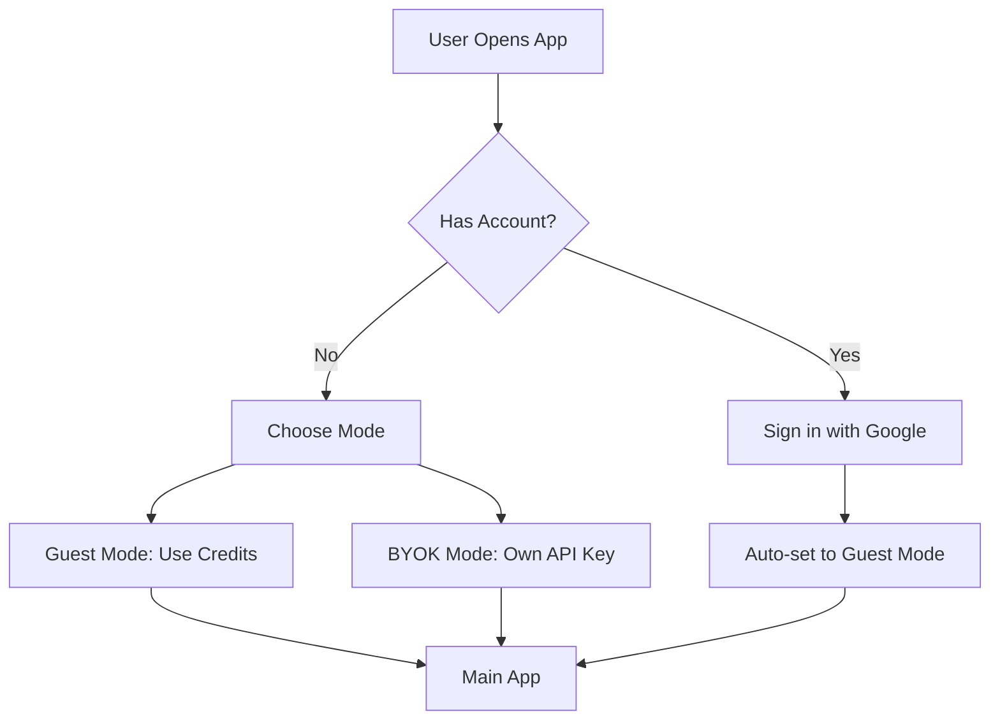
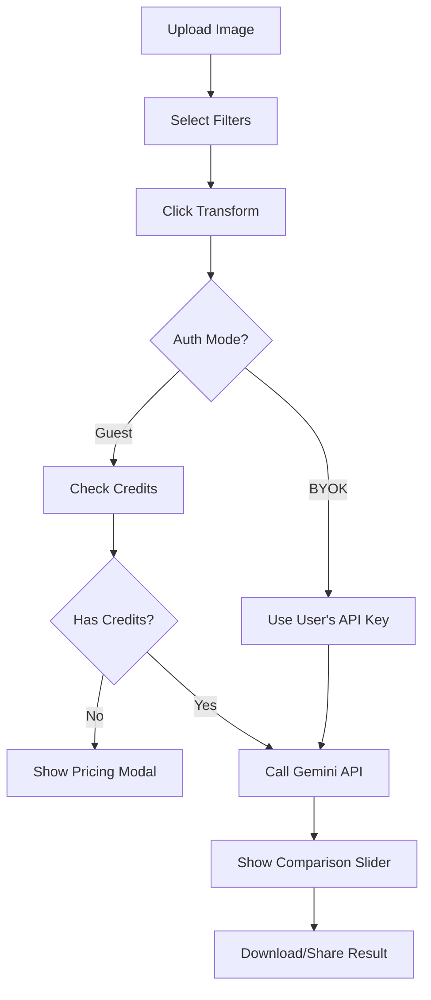

# CivicVision - Product Requirements Document (PRD)

**Version:** 1.0  
**Last Updated:** December 27, 2025  
**Author:** Vatsal Mishra

---

## 1. Executive Summary

CivicVision is an AI-powered web application that transforms photos of urban areas into visualizations of cleaner, greener, and more aesthetically pleasing environments. Users upload photos of streets, buildings, or public spaces, and the app generates an idealized version using Google's Gemini AI.

### Mission
> *"Visualize a cleaner, greener India"*

### Key Value Proposition
- Instantly see how public spaces could look with improvements
- No design skills required - AI handles the transformation
- Useful for urban planners, activists, and citizens advocating for change

---

## 2. Target Users

| Persona | Description | Primary Use Case |
|---------|-------------|------------------|
| **Urban Activist** | Citizens advocating for cleaner cities | Create before/after visuals for social media |
| **Urban Planner** | Government or private urban planners | Quick concept visualization |
| **Real Estate** | Property developers | Show potential of undeveloped areas |
| **NGOs** | Environmental organizations | Campaign materials |
| **General Public** | Curious individuals | Fun exploration of "what-if" scenarios |

---

## 3. User Flows

### 3.1 Authentication Flow



### 3.2 Core Transformation Flow



---

## 4. Features

### 4.1 Core Features (MVP)

| Feature | Status | Description |
|---------|--------|-------------|
| Google Sign-In | ✅ Done | Firebase Authentication |
| Image Upload | ✅ Done | JPEG, PNG, WEBP support |
| Filter Selection | ✅ Done | 9 improvement filters |
| AI Transformation | ✅ Done | Google Gemini API |
| Before/After Slider | ✅ Done | Interactive comparison |
| Image Download | ✅ Done | Composite side-by-side image |
| Credit System | ✅ Done | 3 free credits for new users |
| BYOK Mode | ✅ Done | Bring Your Own API Key |

### 4.2 Enhancement Features

| Feature | Status | Description |
|---------|--------|-------------|
| Social Sharing | ✅ Done | Native share API |
| Pull-to-Refresh | ✅ Done | Mobile UX improvement |
| Mobile Image Preview | ✅ Done | See image while selecting filters |
| Waitlist System | ✅ Done | Capture purchase intent |
| Analytics Tracking | ✅ Done | Firebase Analytics |

### 4.3 Planned Features (Roadmap)

| Feature | Priority | Description |
|---------|----------|-------------|
| Payment Integration | High | Razorpay for credit purchases |
| Before/After Video | Medium | Animated transformation |
| Batch Processing | Low | Multiple images at once |
| Custom Filters | Low | User-defined improvements |

---

## 5. System Architecture

### 5.1 High-Level Architecture

```
┌─────────────────────────────────────────────────────────────────┐
│                         CLIENT (React)                          │
│  ┌─────────────┐  ┌─────────────┐  ┌─────────────┐             │
│  │   Auth UI   │  │  Transform  │  │   Pricing   │             │
│  │  Component  │  │  Component  │  │    Modal    │             │
│  └──────┬──────┘  └──────┬──────┘  └──────┬──────┘             │
│         │                │                │                     │
│  ┌──────▼────────────────▼────────────────▼──────┐             │
│  │              App State Management              │             │
│  └──────────────────────┬────────────────────────┘             │
└─────────────────────────┼───────────────────────────────────────┘
                          │
          ┌───────────────┼───────────────┐
          │               │               │
          ▼               ▼               ▼
┌──────────────┐  ┌──────────────┐  ┌──────────────┐
│   Firebase   │  │   Firebase   │  │    Gemini    │
│     Auth     │  │  Firestore   │  │     API      │
└──────────────┘  └──────────────┘  └──────────────┘
                          │
                          ▼
                  ┌──────────────┐
                  │   Firebase   │
                  │   Functions  │
                  │ (Proxy API)  │
                  └──────────────┘
```

### 5.2 Technology Stack

| Layer | Technology | Purpose |
|-------|------------|---------|
| Frontend | React + TypeScript | UI Framework |
| Styling | TailwindCSS | Utility-first CSS |
| State | React Hooks | Local state management |
| Auth | Firebase Auth | Google Sign-In |
| Database | Firestore | User data, credits, waitlist |
| Serverless | Firebase Functions | API proxy, webhooks |
| AI | Google Gemini | Image transformation |
| Hosting | Vercel | Frontend deployment |
| Analytics | Firebase Analytics | User behavior tracking |

### 5.3 Firebase Functions

| Function | Trigger | Purpose |
|----------|---------|---------|
| `createUserDocument` | Auth.onCreate | Initialize new user with 3 credits |
| `generateImage` | HTTPS Callable | Proxy Gemini API for Guest mode |

---

## 6. Data Models

### 6.1 Firestore Collections

#### `users/{userId}`
```typescript
interface User {
  email: string;
  displayName: string;
  credits: number;           // Default: 3
  createdAt: Timestamp;
  lastLogin: Timestamp;
}
```

#### `waitlist/{docId}`
```typescript
interface WaitlistEntry {
  userId: string;
  email: string;
  selectedPackage: 'starter' | 'popular' | 'pro';
  timestamp: Timestamp;
  notified: boolean;
}
```

### 6.2 Credit Packages

| Package | Credits | Price (₹) | Per Credit |
|---------|---------|-----------|------------|
| Starter | 10 | 49 | ₹4.90 |
| Popular | 50 | 199 | ₹3.98 |
| Pro | 100 | 349 | ₹3.49 |

---

## 7. API Design

### 7.1 Gemini API Integration

**Model:** `gemini-2.0-flash-exp`  
**Endpoint:** Via Firebase Functions (Guest) or Direct (BYOK)

**Request Format:**
```typescript
{
  model: "gemini-2.0-flash-exp",
  contents: [{
    role: "user",
    parts: [
      { text: "Transform this image with: [filters]" },
      { inlineData: { mimeType: "image/jpeg", data: base64 } }
    ]
  }],
  generationConfig: {
    responseModalities: ["Text", "Image"]
  }
}
```

### 7.2 Error Handling

| Error Code | User Message | Action |
|------------|--------------|--------|
| INVALID_API_KEY | Invalid API key | Reset to auth screen |
| QUOTA_EXCEEDED | API quota exceeded | Suggest waiting/upgrading |
| PERMISSION_DENIED | Billing not enabled | Link to Google Cloud Console |
| CONTENT_BLOCKED | Content filtered | Suggest different image |

---

## 8. Security

### 8.1 Authentication
- Firebase Auth with Google Sign-In
- Session managed by Firebase SDK
- No password storage

### 8.2 API Key Protection
- **Guest Mode:** API key stored in Firebase Functions (server-side only)
- **BYOK Mode:** Key stored in sessionStorage (cleared on page close)
- Never logged or transmitted to our servers

### 8.3 Data Privacy
- Only email and display name stored
- Images processed server-side, not stored
- GDPR-compliant (delete on request)

---

## 9. Analytics Events

### User Journey
- `sign_up` - New user registration
- `login` - Returning user login
- `select_auth_mode` - Guest/BYOK selection

### Feature Usage
- `image_uploaded` - Image selected
- `filters_selected` - Filters chosen
- `generate_started` - Transform initiated
- `generate_success` - Transform completed
- `generate_error` - Transform failed
- `image_downloaded` - Result downloaded

### Monetization
- `pricing_modal_opened` - Viewed pricing
- `credits_exhausted` - Ran out of credits
- `purchase_initiated` - Started purchase (waitlist)

---

## 10. Performance Requirements

| Metric | Target |
|--------|--------|
| Page Load | < 3s (LCP) |
| Time to Interactive | < 5s |
| Transform Time | < 30s |
| Mobile Score | > 80 (Lighthouse) |

---

## 11. Future Roadmap

### Phase 2: Monetization (Q1 2025)
- [ ] Razorpay payment integration
- [ ] Subscription model option
- [ ] Referral bonus credits

### Phase 3: Expansion (Q2 2025)
- [ ] Mobile app (React Native)
- [ ] Video transformation
- [ ] Batch processing

### Phase 4: Social (Q3 2025)
- [ ] Public gallery of transformations
- [ ] Community voting
- [ ] Leaderboard
