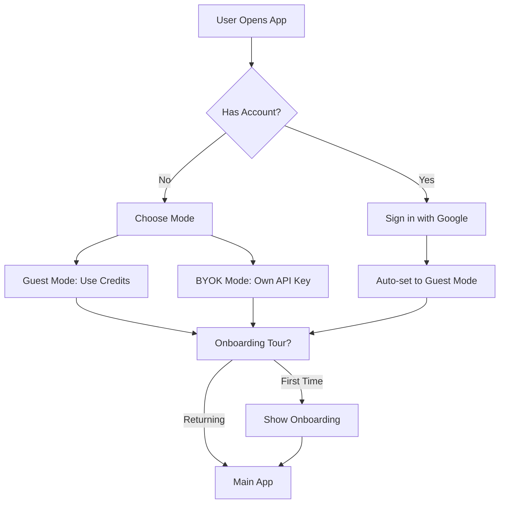
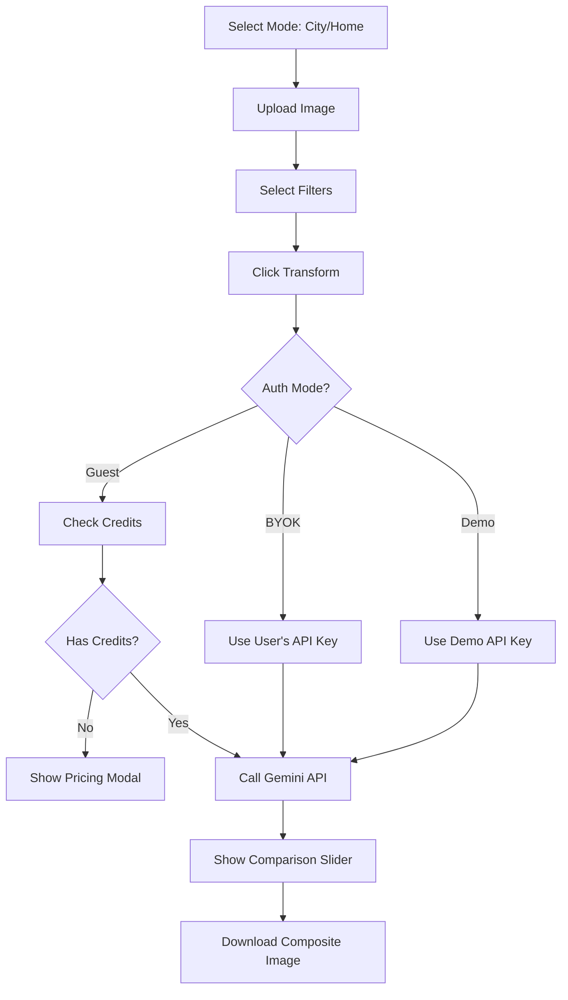

# Redo AI - Product Requirements Document (PRD)

**Version:** 2.1  
**Last Updated:** January 2025  
**Author:** Vatsal Mishra  
**Domain:** [re-do.ai](https://re-do.ai)

---

## 1. Executive Summary

Redo AI is an AI-powered web application that transforms photos into visualizations of improved environments. The app operates in two modes: **City Mode** (urban renewal) and **Home Mode** (interior design). Users upload photos and the app generates idealized versions using Google's Gemini AI.

### Mission
> *"Redo your city and home with AI-powered visualization"*

### Key Value Proposition
- Instantly see how public spaces or interiors could look with improvements
- No design skills required - AI handles the transformation
- Dual modes: Urban renewal (City Mode) and Interior design (Home Mode)
- Useful for urban planners, activists, homeowners, and real estate professionals
- Free credits for new users (2 generations: 1 for City, 1 for Home)

---

## 2. Target Users

| Persona | Description | Primary Use Case |
|---------|-------------|------------------|
| **Urban Activist** | Citizens advocating for cleaner cities | Create before/after visuals for social media |
| **Urban Planner** | Government or private urban planners | Quick concept visualization |
| **Real Estate** | Property developers | Show potential of undeveloped areas |
| **NGOs** | Environmental organizations | Campaign materials |
| **General Public** | Curious individuals | Fun exploration of "what-if" scenarios |
| **Homeowners** | Property owners | Visualize interior design possibilities |
| **Interior Designers** | Design professionals | Quick concept visualization for clients |

---

## 3. User Flows

### 3.1 Authentication Flow



### 3.2 Core Transformation Flow



---

## 4. Features

### 4.1 Core Features (MVP)

| Feature | Status | Description |
|---------|--------|-------------|
| Google Sign-In | ✅ Done | Firebase Authentication with "Login and get 2 generations for free!" message |
| Dual Mode System | ✅ Done | City Mode (urban) + Home Mode (interior) |
| Image Upload | ✅ Done | Drag & drop, JPEG, PNG, WEBP support |
| Filter Selection | ✅ Done | 13 city filters, 25+ home filters (categorized) |
| AI Transformation | ✅ Done | Google Gemini 3 Pro Image Preview |
| Before/After Slider | ✅ Done | Interactive comparison slider with improved touch responsiveness |
| Composite Image Download | ✅ Done | Vertical layout (before on top, after on bottom) with branding |
| Credit System | ✅ Done | 2 free credits for new users (1 for City, 1 for Home) |
| BYOK Mode | ✅ Done | Bring Your Own API Key (unlimited) |
| Demo Mode | ✅ Done | Special mode for Razorpay KYC review |
| Payment Integration | ✅ Done | Full Razorpay integration with webhooks |
| Legal Pages | ✅ Done | Privacy Policy and Terms of Service pages with routing |

### 4.2 Enhancement Features

| Feature | Status | Description |
|---------|--------|-------------|
| Onboarding Tour | ✅ Done | 7-step interactive tutorial for new users |
| Pull-to-Refresh | ✅ Done | Mobile UX improvement |
| Mobile Image Preview | ✅ Done | See image while selecting filters |
| Mode Switcher | ✅ Done | Toggle between City/Home modes |
| Bottom Navigation | ✅ Done | Mobile-optimized navigation bar |
| Filter Categories | ✅ Done | Home filters organized by style/colors/furniture/architectural |
| Share Modal | ✅ Done | Native device share menu with before/after composite image |
| Analytics Tracking | ✅ Done | Firebase Analytics with comprehensive events |
| Real-time Credit Updates | ✅ Done | Firestore listener for instant credit balance |
| Error Handling | ✅ Done | Detailed error messages for API issues |
| Responsive Design | ✅ Done | Mobile-first, works on all screen sizes with safe area insets |
| Legal Pages | ✅ Done | Privacy Policy and Terms of Service accessible at /privacy-policy and /terms-of-service |
| Payment Disclaimer | ✅ Done | "International payments & subscriptions coming soon" notice |
| Custom Pricing Contact | ✅ Done | Email link for bulk orders and custom pricing inquiries |

### 4.3 Planned Features (Roadmap)

| Feature | Priority | Description |
|---------|----------|-------------|
| Subscription Model | Medium | Monthly recurring credit plans |
| Before/After Video | Medium | Animated transformation |
| Batch Processing | Low | Multiple images at once |
| Custom Filters | Low | User-defined improvements |
| AI Studio Integration | Medium | Direct integration with Google AI Studio key selector |
| Referral System | Low | Bonus credits for inviting friends |

---

## 5. System Architecture

### 5.1 High-Level Architecture

```
┌─────────────────────────────────────────────────────────────────┐
│                         CLIENT (React)                          │
│  ┌─────────────┐  ┌─────────────┐  ┌─────────────┐             │
│  │   Auth UI   │  │  Transform  │  │   Pricing   │             │
│  │  Component  │  │  Component  │  │    Modal    │             │
│  └──────┬──────┘  └──────┬──────┘  └──────┬──────┘             │
│         │                │                │                     │
│  ┌──────▼────────────────▼────────────────▼──────┐             │
│  │              App State Management              │             │
│  └──────────────────────┬────────────────────────┘             │
└─────────────────────────┼───────────────────────────────────────┘
                          │
          ┌───────────────┼───────────────┐
          │               │               │
          ▼               ▼               ▼
┌──────────────┐  ┌──────────────┐  ┌──────────────┐
│   Firebase   │  │   Firebase   │  │    Gemini    │
│     Auth     │  │  Firestore   │  │     API      │
└──────────────┘  └──────────────┘  └──────────────┘
                          │
                          ▼
                  ┌──────────────┐
                  │   Firebase   │
                  │   Functions  │
                  │ (Proxy API)  │
                  └──────────────┘
```

### 5.2 Technology Stack

| Layer | Technology | Purpose |
|-------|------------|---------|
| Frontend | React 19.2 + TypeScript 5.8 | UI Framework |
| Build Tool | Vite 6.2 | Fast development and builds |
| Styling | TailwindCSS 4.1 | Utility-first CSS |
| Animations | Framer Motion 12 | Smooth UI transitions |
| State | React Hooks + Context | Local state management |
| Auth | Firebase Auth | Google Sign-In |
| Database | Firestore | User data, credits, payments |
| Serverless | Firebase Functions (Node 20) | API proxy, webhooks, credit management |
| AI SDK | @google/genai 1.34 | Gemini API client |
| AI Model | Gemini 3 Pro Image Preview | High-quality image editing |
| Payment | Razorpay | Credit purchases (Full Integration, India only) |
| Hosting | Vercel | Frontend deployment with client-side routing |
| Routing | React Router DOM 6.26 | Client-side routing for legal pages |
| Analytics | Firebase Analytics + Vercel Analytics | User behavior tracking |

### 5.3 Firebase Functions

| Function | Trigger | Purpose |
|----------|---------|---------|
| `createUserDocument` | Auth.onCreate | Initialize new user with 2 credits (1 for City, 1 for Home) |
| `generateImage` | HTTPS Callable | Proxy Gemini API for Guest mode, deducts 1 credit |
| `addCredits` | HTTPS Callable | Manually add credits (for testing/admin) |
| `createRazorpayOrder` | HTTPS Callable | Create payment order for credit purchase |
| `razorpayWebhook` | HTTPS Request | Verify payment and add credits automatically |
| `verifyPayment` | HTTPS Callable | Client-side signature verification after payment |

### 5.4 Component Architecture

**Core Components:**
- `App.tsx` - Main application orchestrator, state management
- `AppRouter.tsx` - React Router setup for legal pages routing
- `AuthScreen.tsx` - Authentication selection (Google Sign-In / BYOK)
- `ImageUploader.tsx` - Drag & drop image upload with preview
- `FilterControls.tsx` - Filter selection sidebar (categorized for Home mode)
- `ComparisonSlider.tsx` - Interactive before/after slider with improved touch handling
- `PricingModal.tsx` - Credit packages and Razorpay integration with custom pricing contact
- `Onboarding.tsx` - 7-step interactive tutorial
- `ModeSwitcher.tsx` - Toggle between City/Home modes
- `BottomNavBar.tsx` - Mobile navigation and upload trigger
- `ShareModal.tsx` - Native device share menu with composite image
- `PrivacyPolicy.tsx` - Privacy Policy page component
- `TermsOfService.tsx` - Terms of Service page component

**Contexts & Hooks:**
- `AuthContext.tsx` - User authentication and credit management
- `usePullToRefresh.ts` - Mobile pull-to-refresh functionality

**Services:**
- `geminiService.ts` - Gemini API client wrapper
- `analyticsService.ts` - Firebase Analytics event tracking

**Utilities:**
- `imageUtils.ts` - Composite image generation (vertical layout: before on top, after on bottom)

---

## 6. Data Models

### 6.1 Firestore Collections

#### `users/{userId}`
```typescript
interface User {
  email: string;
  displayName: string;
  photoURL?: string;
  credits: number;           // Default: 2 (1 for City, 1 for Home)
  createdAt: Timestamp;
  lastUsedAt: Timestamp;
  lastPurchaseAt?: Timestamp;
  lastRefundAt?: Timestamp;
}
```

#### `payments/{paymentId}`
```typescript
interface Payment {
  userId: string;
  orderId: string;
  paymentId: string;
  packageId: string;
  amount: number;           // in rupees
  credits: number;
  status: 'captured' | 'failed' | 'refunded';
  createdAt: Timestamp;
  refundId?: string;
  refundedAt?: Timestamp;
}
```

#### `refunds/{refundId}`
```typescript
interface Refund {
  userId: string;
  paymentId: string;
  refundId: string;
  packageId: string;
  amount: number;
  creditsDeducted: number;
  status: 'processed' | 'failed' | 'payment_not_found';
  createdAt: Timestamp;
}
```

#### `failed_payments/{docId}`
```typescript
interface FailedPayment {
  orderId: string;
  paymentId: string;
  errorCode: string;
  errorDescription: string;
  timestamp: Timestamp;
}
```

### 6.2 Credit Packages

| Package | Credits | Price (₹) | Per Credit |
|---------|---------|-----------|------------|
| Starter | 10 | 49 | ₹4.90 |
| Popular | 50 | 199 | ₹3.98 |
| Pro | 100 | 349 | ₹3.49 |

---

## 7. API Design

### 7.1 Gemini API Integration

**Model:** `gemini-3-pro-image-preview`  
**Endpoint:** Via Firebase Functions (Guest) or Direct (BYOK/Demo)  
**SDK:** `@google/genai` v1.34.0

**Request Format:**
```typescript
{
  model: "gemini-3-pro-image-preview",
  contents: [
    {
      inlineData: {
        mimeType: "image/jpeg",
        data: base64Image
      }
    },
    {
      text: "Transform this image with: [filters]"
    }
  ],
  config: {
    responseModalities: ["Text", "Image"]
  }
}
```

**Mode-Specific Prompts:**
- **City Mode:** Urban renewal focus (trash removal, paint, greenery, infrastructure, wire removal, flowers)
- **Home Mode:** Interior design focus (style presets, colors, furniture, architectural changes)

**Headlines:**
- **City Mode:** "Redo Your Neighborhood"
- **Home Mode:** "Redo Your Space"

### 7.2 Error Handling

| Error Code | User Message | Action |
|------------|--------------|--------|
| INVALID_API_KEY | Invalid API key | Show error, allow retry or key change |
| QUOTA_EXCEEDED | Daily quota exceeded (~2 images/day free) | Suggest waiting/upgrading billing |
| PERMISSION_DENIED | Model access denied, billing not enabled | Link to Google AI Studio |
| MODEL_NOT_AVAILABLE | Model not available for account | Suggest enabling billing |
| CONTENT_BLOCKED | Image blocked by safety filters | Suggest different image |
| RESOURCE_EXHAUSTED | Insufficient credits (Guest mode) | Show pricing modal |

---

## 8. Security

### 8.1 Authentication
- Firebase Auth with Google Sign-In
- Session managed by Firebase SDK
- No password storage

### 8.2 API Key Protection
- **Guest Mode:** API key stored in Firebase Functions secrets (server-side only)
- **BYOK Mode:** Key stored in `sessionStorage` (cleared on page close)
- **Demo Mode:** Uses environment variable (for KYC review purposes)
- Never logged or transmitted to our servers
- BYOK keys never sent to Firebase Functions

### 8.3 Payment Security
- **Razorpay Integration:** 
  - Server-side order creation (never trust client amounts)
  - Webhook signature verification using HMAC-SHA256 and raw body
  - Duplicate payment processing prevention
  - Automatic credit deduction on refunds
- **Credit Management:** 
  - Atomic transactions in Firestore for credit deduction and addition
  - Server-side validation of credit balance before AI calls

### 8.4 Data Privacy
- Only email and display name stored
- Images processed via Gemini API, not stored on our servers
- GDPR-compliant (delete on request)
- Privacy Policy and Terms of Service available at `/privacy-policy` and `/terms-of-service`
- Links to legal pages in authentication screen footer

---

## 9. Analytics Events

### User Journey
- `sign_up` - New user registration (method: google/byok)
- `login` - Returning user login (method: google/byok)
- `select_auth_mode` - Guest/BYOK selection
- `onboarding_completed` - Finished onboarding tour
- `onboarding_skipped` - Skipped onboarding tour

### Feature Usage
- `image_uploaded` - Image selected
- `filters_selected` - Filters chosen (includes filter IDs and count)
- `generate_started` - Transform initiated (includes filter count, auth mode)
- `generate_success` - Transform completed (includes filter count, auth mode)
- `generate_error` - Transform failed (includes error type, auth mode)
- `image_downloaded` - Result downloaded
- `share_clicked` - Share button clicked

### Monetization
- `pricing_modal_opened` - Viewed pricing (includes current credits)
- `credits_exhausted` - Ran out of credits
- `purchase_initiated` - Started purchase (includes package ID, amount)
- `purchase_success` - Payment completed successfully
- `purchase_error` - Payment failed or was cancelled

---

## 10. Performance Requirements

| Metric | Target |
|--------|--------|
| Page Load | < 3s (LCP) |
| Time to Interactive | < 5s |
| Transform Time | < 30s |
| Mobile Score | > 80 (Lighthouse) |

---

## 11. Implementation Details

### 11.1 Filter System

**City Mode Filters (13 total):**
- Remove Trash (default)
- Manicured Greenery (default)
- Fresh Paint & Repair
- Remove Debris
- European Infrastructure
- European Aesthetics
- Remove People
- Deep Clean
- Restore Metalwork
- Remove Wires
- Add Flowers & Plants

**Home Mode Filters (20+ total, categorized):**
- **Style Presets:** Modern (default), Scandinavian, Minimalist, Bohemian, Industrial, Mid-Century Modern, Japanese Zen, Coastal
- **Colors & Paint:** Warm Neutrals, Cool Tones, Bold Accent Wall, Earthy Palette
- **Furniture & Decor:** Modern Furniture (default), Indoor Plants (default), Warm Lighting (default), Cozy Textiles (default), Declutter, Wall Art & Decor
- **Architectural:** Natural Light, Upgrade Flooring, Open Floor Concept

### 11.2 App States

```typescript
enum AppState {
  IDLE = 'IDLE',               // Initial state, show uploader
  UPLOADING = 'UPLOADING',     // Processing initial upload
  READY = 'READY',             // Image loaded, ready to generate
  GENERATING = 'GENERATING',   // AI processing
  COMPARING = 'COMPARING'       // Showing results
}
```

### 11.3 Credit Deduction Flow

1. User initiates transformation in Guest mode
2. Frontend checks credits (via AuthContext)
3. If credits > 0, calls Firebase Function `generateImage`
4. Function verifies credits again (atomic check)
5. Calls Gemini API
6. On success, deducts 1 credit using Firestore transaction
7. Returns generated image + updated credit count
8. Frontend updates via Firestore listener

### 11.4 Composite Image Generation

The share/download feature creates a vertical composite image:
- **Dimensions:** Original image aspect ratio, max height 2048px per image
- **Layout:** Before (top) | After (bottom) - optimized for mobile sharing
- **Branding:** "BEFORE" label (top-left), "AFTER" label (top-left of bottom section)
- **Footer:** "Transformed with Redo AI" at bottom
- **Format:** JPEG, 85% quality
- **Gradients:** Top, middle (divider), and bottom overlays for text readability
- **Share Text:** "I reimagined this space with Redo AI"

### 11.5 Demo Mode

Special mode activated via URL parameter `?demo=razorpay`:
- Uses environment variable API key (for Razorpay KYC reviewers)
- Shows "DEMO MODE" badge
- Local credit counter (starts at 3)
- Separate onboarding completion flag
- Allows testing without Firebase authentication

## 12. Future Roadmap

### Phase 2: Monetization (Q1 2025)
- [x] Razorpay backend integration
- [x] Frontend payment flow integration
- [x] Custom pricing contact section
- [ ] Subscription model option
- [ ] International payments support
- [ ] Referral bonus credits

### Phase 3: Expansion (Q2 2025)
- [ ] Mobile app (React Native)
- [ ] Video transformation
- [ ] Batch processing
- [ ] AI Studio direct integration

### Phase 4: Social (Q3 2025)
- [ ] Public gallery of transformations
- [ ] Community voting
- [ ] Leaderboard
- [ ] Share with custom branding
