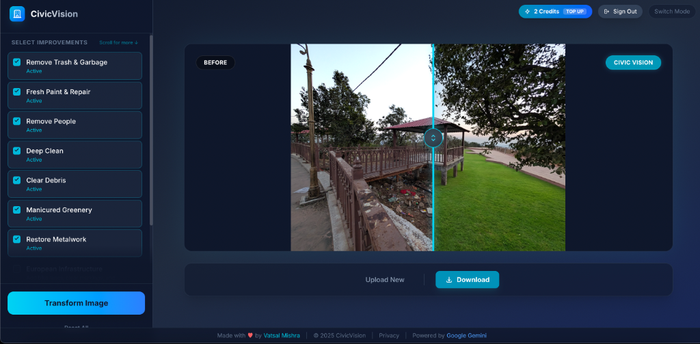

<div align="center">



</div>

# CivicVision - Urban Beautifier

An AI-powered web application that visualizes clean, maintained, and beautified versions of urban environments by removing trash, cleaning structures, and adding greenery.

## ✨ Features

- 🏙️ **Urban Transformation**: Upload photos of cityscapes and see them transformed
- 🗑️ **Smart Cleanup**: Remove trash, litter, and debris
- 🎨 **Building Restoration**: Apply fresh paint and repair damaged structures
- 🌳 **Green Spaces**: Add manicured lawns and greenery to barren areas
- 🚴 **European Infrastructure**: Optional bike lanes and modern street design
- 🔄 **Interactive Comparison**: Side-by-side slider to compare before/after

## 🚀 Getting Started

**Prerequisites:** Node.js

1. **Install dependencies:**
   ```bash
   npm install
   ```

2. **Set up your API key:**
   - Create a `.env.local` file in the project root
   - Add your Gemini API key: `GEMINI_API_KEY=your_api_key_here`
   - Get a free API key at [Google AI Studio](https://aistudio.google.com/app/apikey)

3. **Run the app:**
   ```bash
   npm run dev
   ```

4. **Open in browser:**
   Navigate to `http://localhost:3000`

## 🎯 Usage

1. Choose authentication mode (Free Trial or Bring Your Own API Key)
2. Upload an urban photo
3. Select transformation filters (trash removal, paint refresh, greenery, etc.)
4. Click "Transform Image" and wait for AI processing
5. Compare results with the interactive slider
6. Share or download your transformed image

## 🛠️ Built With

- **React 19** - UI Framework
- **TypeScript** - Type Safety
- **Vite** - Build Tool
- **Tailwind CSS** - Styling
- **Google Gemini AI** - Image Generation & Editing

## 📄 License

This project is open source and available under the [GNU Affero General Public License v3.0](LICENSE).

## 🤝 Contributing

Contributions, issues, and feature requests are welcome!
